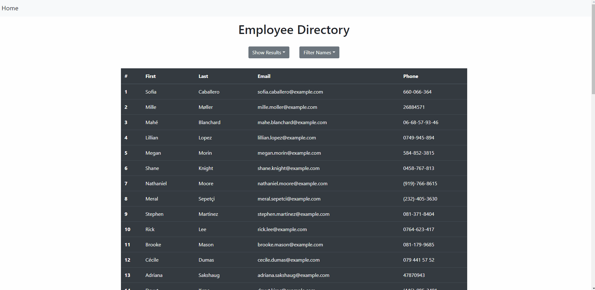

# Employee Directory

## Description
    A simple online directory that can be organized into alphabetically sorted sections. 
    
## Table of Contents 
1. [Installation](#installation)
2. [Usage](#usage)
3. [Technologies](#technologies)
4. [Demo](#demo)
5. [License](#license)
6. [Contributing](#contributing)
7. [Tests](#tests)
8. [Questions](#questions)
    
## Installation
Clone the repo and `npm install` all dependencies. 

## Usage
Visit the site url: https://rkraeher.github.io/employee-directory-react

## Technologies
React.js, Random User Generator API.

## Demo
  

## License 
  
Copyright (c) 2020 Rudi Kraeher
    
## Contributing
If you wish to contribute please send me an email.
    
## Tests
No testing guidelines at this time.
    
## Questions
If you have any questions about the repo you can email me at rudikraeher@gmail.com.  
Visit my [GitHub](https://github.com/rkraeher) to see more of my work.